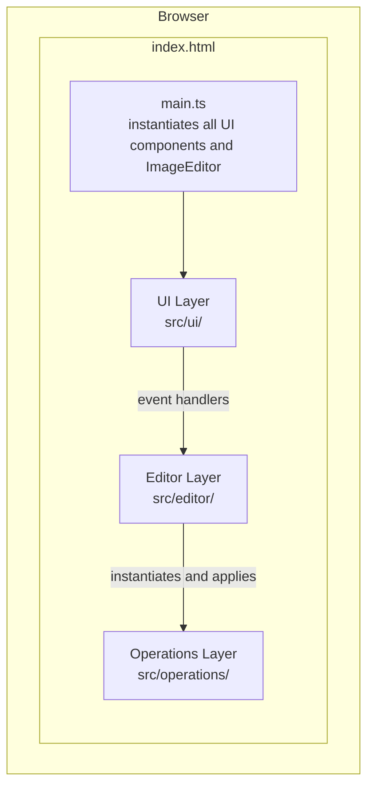
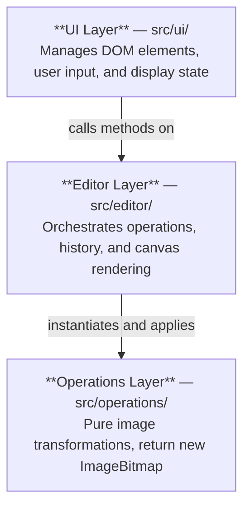
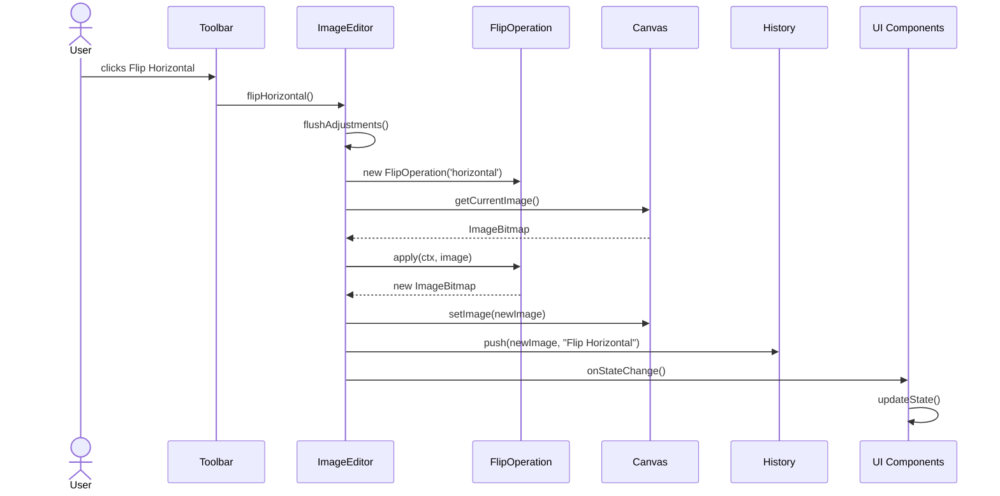
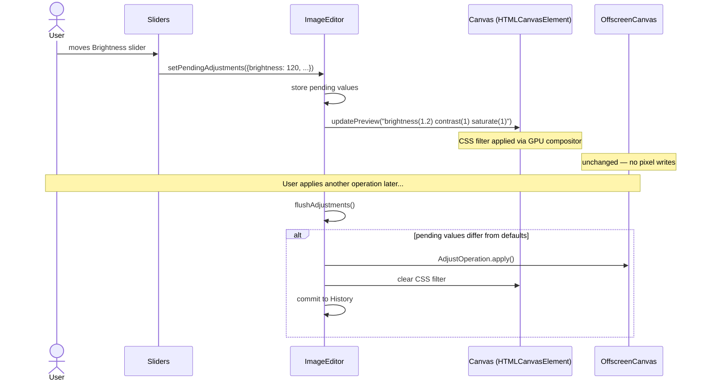
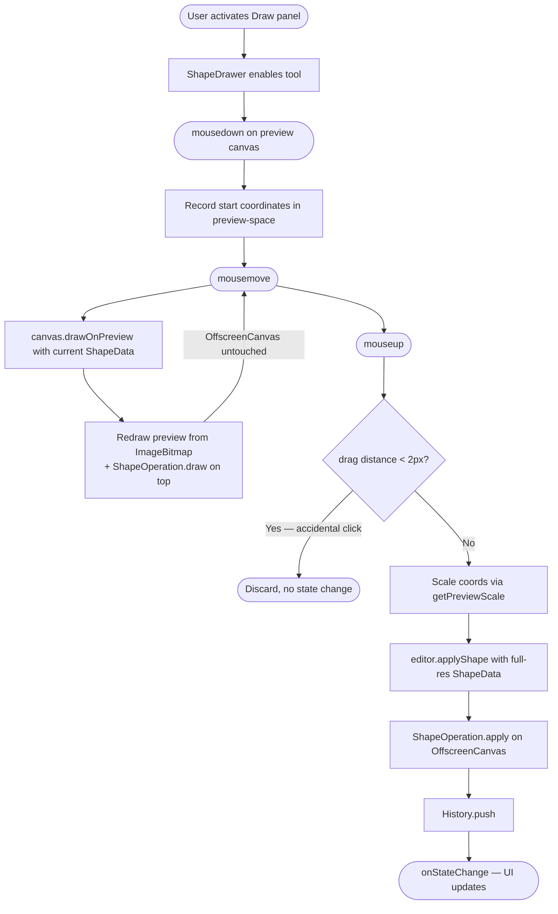
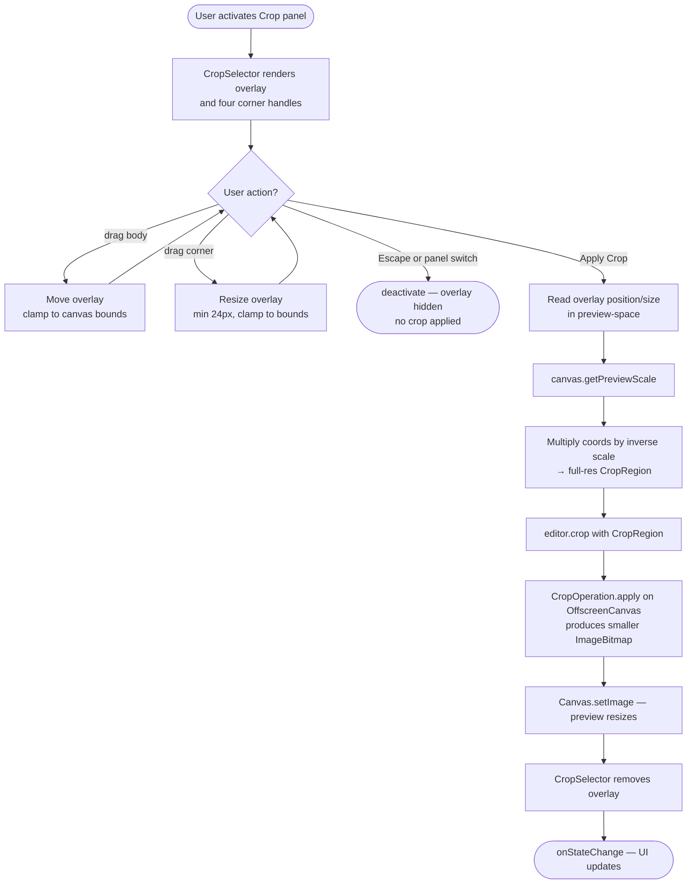

# Architecture — Photo Editor

A browser-based image editor built with TypeScript and the HTML5 Canvas API.
No server. No login. No storage. Everything happens in memory; the user downloads
their result when they're done.

---

## Table of Contents

1. [What it does](#1-what-it-does)
2. [Core principles](#2-core-principles)
3. [System overview](#3-system-overview)
4. [Tech stack](#4-tech-stack)
5. [Layer structure](#5-layer-structure)
6. [Key components](#6-key-components)
7. [Data flows](#7-data-flows)
8. [Design decisions](#8-design-decisions)
9. [Types](#9-types)
10. [Known limitations](#10-known-limitations)
11. [How to extend](#11-how-to-extend)
12. [File map](#12-file-map)
13. [Deployment](#13-deployment)

---

## 1. What it does

- **Transforms**: flip, rotate, crop, upscale
- **Adjustments**: brightness, contrast, saturation
- **Drawing**: rectangles and circles (filled or outlined)
- **Merge**: composite a second image left, right, top, or bottom
- **History**: undo and redo for every operation
- **Export**: PNG or JPEG at full resolution

The app is designed to feel instant. Preview feedback is immediate. Heavy operations
never block the UI.

---

## 2. Core principles

**Separation of concerns** — UI components own the DOM. The editor layer owns state.
Operations are pure functions with no knowledge of UI or state.

**Immutable image data** — No operation modifies an existing `ImageBitmap`. Every
operation returns a new one. This makes undo/redo reliable.

**Decoupled resolution** — The preview and the stored image are kept separate. The
preview scales to the viewport; the stored image stays at original resolution. The UI
stays fast regardless of image size.

**Stateless operations** — Each operation is created with its parameters and applied
once. No shared mutable state.

**No premature abstraction** — No registries, plugin systems, or shared utilities
that aren't needed yet. Adding an operation means adding one class and one call site.

---

## 3. System overview

The app is a single-page application. No network calls happen after the initial load.



Image data never leaves the user's machine.

---

## 4. Tech stack

| What | Choice |
|---|---|
| Language | TypeScript 5.3 (strict mode) |
| Build tool | Vite 5.0 |
| Target | ES2020 / modern browsers |
| Canvas | `HTMLCanvasElement` (preview) + `OffscreenCanvas` (editing) |
| Icons | Lucide (runtime only) |
| Styling | Plain CSS with custom properties, dark theme |
| Backend | None |

---

## 5. Layer structure

Three layers. Dependencies only flow downward.



### 5.1 UI Layer — `src/ui/`

Each component:
- Gets a reference to `ImageEditor` at construction
- Queries the DOM for its elements by ID
- Attaches its own event listeners
- Calls `ImageEditor` methods when the user acts
- Listens to `onStateChange` to update disabled/enabled states

Components don't talk to each other directly. All coordination goes through `ImageEditor`.

| Component | What it does |
|---|---|
| `Toolbar` | Upload, Undo/Redo, Download, Flip, Rotate, Upscale |
| `Sliders` | Brightness, Contrast, Saturation. Drives live preview via `setPendingAdjustments`. |
| `CategoryTabs` | Switches between Transform, Crop, Draw, Merge, and Adjust panels. |
| `CropSelector` | Resizable overlay on the preview canvas. Converts preview coordinates to full-resolution. |
| `ShapeDrawer` | Drag-to-draw shapes. Scales coordinates to full resolution before applying. |
| `MergeDialog` | Picks a second image and a merge position (left/right/top/bottom). |
| `KeyboardShortcuts` | Global key handler. Maps keys to editor actions without coupling to other components. |

**Keyboard shortcuts**

Chord shortcuts (always active):

| Keys | Action |
|---|---|
| `Ctrl+O` | Upload image |
| `Ctrl+Z` | Undo |
| `Ctrl+Y` / `Ctrl+Shift+Z` | Redo |
| `Ctrl+S` | Download |

Single-key shortcuts (blocked inside text inputs, active on range sliders):

| Key | Action |
|---|---|
| `T` | Transform tab |
| `C` | Crop tab |
| `D` | Draw tab |
| `M` | Merge tab |
| `A` | Adjust tab |
| `H` | Flip horizontal |
| `V` | Flip vertical |
| `[` | Rotate counter-clockwise |
| `]` | Rotate clockwise |
| `R` | Rectangle shape |
| `E` | Circle shape |
| `F` | Toggle filled/outlined |
| `I` | Open merge image picker |
| `B` | Focus brightness slider |
| `K` | Focus contrast slider |
| `S` | Focus saturation slider |
| `0` | Reset adjustments |

The `isTyping()` guard blocks single-key shortcuts inside `<textarea>` and `<select>`,
and inside `<input>` elements unless the type is `range`. This lets `B`, `K`, and `S`
still work when a slider already has focus.

### 5.2 Editor Layer — `src/editor/`

| Class | What it does |
|---|---|
| `ImageEditor` | The main orchestrator. Exposes all editing operations as async methods. Manages pending adjustments. |
| `Canvas` | Manages the dual-canvas system. Loads images, updates the preview, and handles export. |
| `History` | A capped stack of `ImageBitmap` snapshots. Supports push, undo, and redo. |

### 5.3 Operations Layer — `src/operations/`

Each operation implements this interface:

```ts
interface Operation {
  apply(ctx: OffscreenCanvasRenderingContext2D, image: ImageBitmap): Promise<ImageBitmap>;
  getDescription(): string;
}
```

Operations are the only place pixel manipulation happens. They take a canvas context
and the current image and return a new `ImageBitmap`. Nothing else.

| Operation | What it does |
|---|---|
| `FlipOperation` | Mirror using canvas `translate` + `scale(-1,1)` / `scale(1,-1)` |
| `RotateOperation` | Rotate 90°. Recalculates canvas dimensions when width and height swap. |
| `CropOperation` | Extract a subregion. Input coordinates are clamped to image bounds. |
| `MergeOperation` | Draw two images side-by-side or stacked. Scales the second to fit the merge axis. |
| `AdjustOperation` | Brightness, contrast, saturation via CSS filter strings on the canvas context. |
| `ShapeOperation` | Draw rect or circle. Also exposes a static `draw()` for live preview without committing. |
| `UpscaleOperation` | Render onto a larger canvas with `imageSmoothingQuality = 'high'`. |

---

## 6. Key components

### `ImageEditor`

The facade between UI and everything else. The UI never touches `Canvas`, `History`,
or any `Operation` directly.

State it holds:
- Whether an image is loaded
- Pending adjustment values (brightness, contrast, saturation) previewed but not committed
- References to `Canvas` and `History`

What it delegates:
- Applying an operation → `Canvas` + `History.push()`
- Undo/redo → `History`, then `Canvas.setImage()`
- Live preview → `Canvas.updatePreview()`
- Export → `Canvas`

Before any non-adjustment operation, `ImageEditor` automatically flushes pending
adjustments. The committed history always reflects what the user saw.

### `Canvas`

Manages two rendering surfaces:

**Preview canvas** (`HTMLCanvasElement`) — The visible element in the DOM. Always
scaled to fit the viewport. CSS filters are applied here for instant adjustment
preview. Crop and shape tools interact with this canvas.

**Full-resolution canvas** (`OffscreenCanvas`) — Never shown directly. Holds the
image at original dimensions. All operations execute here. Exports read from here.

This split means resizing the window or moving a slider never triggers a full
pixel-level re-render.

### `History`

A linear array of `{ image: ImageBitmap, description: string }` entries, capped
at 50.

- `push()` — Appends and discards any entries ahead of the current pointer.
- `undo()` / `redo()` — Moves the pointer and returns the image.
- `canUndo()` / `canRedo()` — Checks availability.

When the 50-entry limit is hit, the oldest entry is dropped before pushing the new one.

### `Operations`

`BaseOperation` is an abstract class with a shared `createImageBitmap()` helper.
All concrete operations extend it.

Each operation is constructed with its parameters and applied once. `getDescription()`
returns a human-readable label used in history (e.g. `"Flip Horizontal"`, `"Crop"`).

### UI Components

Every component follows the same initialization pattern:

```ts
constructor(editor: ImageEditor) {
  this.editor = editor;
  this.bindElements();   // query DOM by ID
  this.bindEvents();     // attach listeners
  editor.onStateChange = () => this.updateState();
}
```

`onStateChange` carries no payload. The UI pulls current state from the editor
(`canUndo`, `canRedo`, `hasImage`) and updates the DOM.

Cross-tool deactivation is wired in `main.ts`:

```ts
tabs.onDeactivate['crop'] = () => cropSelector.deactivate();
tabs.onDeactivate['draw'] = () => shapeDrawer.deactivate();
```

This keeps UI components unaware of each other. `main.ts` also wires the window
resize handler so the preview stays sharp when the viewport changes.

---

## 7. Data flows

### 7.1 Standard operation flow

What happens when the user clicks a button that commits an operation (e.g. Flip Horizontal).



### 7.2 Live preview flow (pending adjustments)

What happens when the user moves a slider.



Slider feedback is instant because no pixels are computed. Adjustments are only
committed to history when the user takes their next action.

### 7.3 Shape drawing flow

What happens when the user drags to draw a shape.



During the drag, only the preview canvas is touched. The `OffscreenCanvas` and
history are unchanged until the user releases the mouse.

### 7.4 Crop selection flow

What happens when the user defines and applies a crop.



---

## 8. Design decisions

### Dual canvas system

The preview is a scaled copy of the image. The `OffscreenCanvas` holds the original.
CSS filters are applied to the preview for instant adjustment feedback; pixel operations
run on the `OffscreenCanvas` only when committed.

This means UI responsiveness is independent of image size.

### Strategy pattern for operations

Each operation is a separate class implementing a common interface. `ImageEditor`
applies them through that interface. Adding a new operation means one new file and
one new call site — nothing else changes.

### CSS filters for adjustment preview

Computing brightness/contrast/saturation per-pixel on every slider tick is too slow.
Instead, a CSS filter string is applied to the preview canvas element. The browser
handles this via the GPU compositor. No JavaScript pixel loop runs.

The tradeoff: the preview may differ slightly from the committed result in edge cases,
since canvas filter rendering and CSS compositor rendering aren't always identical.

### No backend

The feature set doesn't need persistence, sharing, or server-side computation. A
backend would add cost, latency, and data obligations with no user benefit.

### Linear history

History is a flat array with a pointer. No branching. A new operation after an undo
discards the redo stack. The 50-entry cap bounds memory usage.

### Immutable `ImageBitmap`

Every operation produces a new `ImageBitmap`. The input is never modified. This makes
the history stack reliable and avoids hard-to-trace shared-reference bugs.

### No event bus

Components communicate only through `ImageEditor` and the `onStateChange` callback.
No shared event bus, observable store, or singleton beyond `ImageEditor`. The app is
small enough that this is sufficient, and it keeps the data flow easy to follow.

---

## 9. Types

Defined in `src/types.ts` and imported where needed.

```ts
interface Operation {
  apply(ctx: OffscreenCanvasRenderingContext2D, image: ImageBitmap): Promise<ImageBitmap>;
  getDescription(): string;
}

type CropRegion = { x: number; y: number; width: number; height: number };

type AdjustmentValues = {
  brightness: number;  // 100 = identity
  contrast: number;
  saturation: number;
};

type MergePosition = 'left' | 'right' | 'top' | 'bottom';

type ShapeType = 'rect' | 'circle';

type ShapeData = {
  type: ShapeType;
  x: number; y: number; width: number; height: number;
  color: string;
  lineWidth: number;
  filled: boolean;
};

type HistoryEntry = { image: ImageBitmap; description: string };
```

---

## 10. Known limitations

**Memory** — Large images across 50 history entries can use a lot of memory.
`ImageBitmap` objects can't be compressed. The 50-entry cap limits the worst case.

**No cross-session history** — Reloading the page resets everything. Intentional
consequence of having no backend.

**Single `onStateChange` listener** — `onStateChange` is a single function reference,
not a list. Switching to multiple listeners would require changing it to an array.

**Limited accessibility** — Keyboard shortcuts exist but ARIA labels and roles
haven't been systematically applied. Screen reader support is limited.

**Browser requirement** — `OffscreenCanvas` is required. All major browsers support
it as of 2025.

---

## 11. How to extend

**Add a new image operation:**
1. Create a file in `src/operations/` extending `BaseOperation`.
2. Implement `apply()` to return a new `ImageBitmap`.
3. Implement `getDescription()` for the history label.
4. Add a method to `ImageEditor` that calls `applyOperation()`.
5. Wire a UI element in the right component.

Nothing else changes.

**Add a new UI panel:**
1. Create a class in `src/ui/`.
2. Inject `ImageEditor` in the constructor.
3. Query DOM elements and attach events.
4. Register the panel in `CategoryTabs` if it needs a tab.
5. Add the DOM to `index.html`.

**Change the history limit:**

Update `MAX_HISTORY` in `src/editor/History.ts`.

---

## 12. File map

```
/
├── index.html              All DOM structure. No JS framework.
├── vite.config.ts          Build config. Sets outDir and base URL.
├── tsconfig.json           TypeScript strict mode, ES2020, noEmit.
├── package.json            deps: lucide. devDeps: vite, typescript.
└── public/
    └── CNAME               Custom domain. Copied into dist/ on build.

src/
├── main.ts                 Entry point. Wires all components together,
│                           cross-tool deactivation, and window resize.
├── types.ts                Shared types: Operation, CropRegion,
│                           AdjustmentValues, MergePosition, ShapeData, etc.
├── styles.css              Dark theme. Plain CSS, no preprocessor.
│
├── editor/
│   ├── ImageEditor.ts      Facade. All editing methods live here.
│   ├── Canvas.ts           Dual-canvas system. Preview + OffscreenCanvas.
│   └── History.ts          Undo/redo stack, capped at 50 entries.
│
├── operations/
│   ├── Operation.ts        BaseOperation with createImageBitmap() helper.
│   ├── FlipOperation.ts    Mirror via canvas transform.
│   ├── RotateOperation.ts  90° rotation, swaps dimensions.
│   ├── CropOperation.ts    Extract a region.
│   ├── MergeOperation.ts   Composite two images.
│   ├── AdjustOperation.ts  CSS filter adjustments. Static buildFilter().
│   ├── ShapeOperation.ts   Draw rect/circle. Static draw() for preview.
│   └── UpscaleOperation.ts Scale up with high-quality smoothing.
│
└── ui/
    ├── Toolbar.ts           Upload, undo/redo, download, flip, rotate, upscale.
    ├── Sliders.ts           Adjustment sliders + reset.
    ├── CategoryTabs.ts      Tab switcher with deactivation callbacks.
    ├── CropSelector.ts      Resizable crop overlay.
    ├── ShapeDrawer.ts       Drag-to-draw with live preview.
    ├── MergeDialog.ts       Modal for merge position.
    └── KeyboardShortcuts.ts Global keyboard handler.
```

---

## 13. Deployment

Deployed as a static site on GitHub Pages.

`npm run build` runs `tsc && vite build` and produces `dist/`. Vite copies
everything in `public/` into `dist/` verbatim, so `dist/CNAME` is always present.

`public/CNAME` contains `editor.joseiedo.com`. GitHub Pages reads it and routes
the custom domain to the repository. Vite's `base` is set to `'/'` because the
custom domain serves from the root, not a subdirectory.

No server configuration needed.
