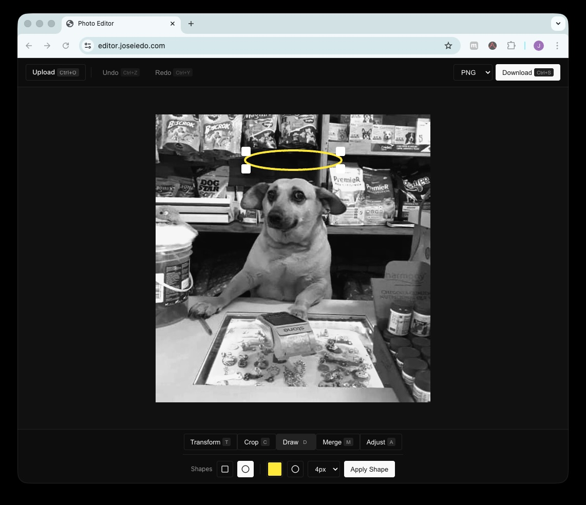

# photo-editor



A browser-based photo editor built with TypeScript and the Canvas API.

## Features

- Flip horizontal / vertical
- Rotate 90deg steps
- Crop with drag selection
- Merge two images side by side
- Brightness, contrast, and saturation adjustments
- Undo / redo history
- Export as PNG or JPEG at full resolution
- No Ads or any bullshit that saves your data

## Stack

- TypeScript
- Vite
- Canvas API + OffscreenCanvas

## Running locally

```sh
npm install
npm run dev
```
